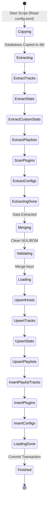
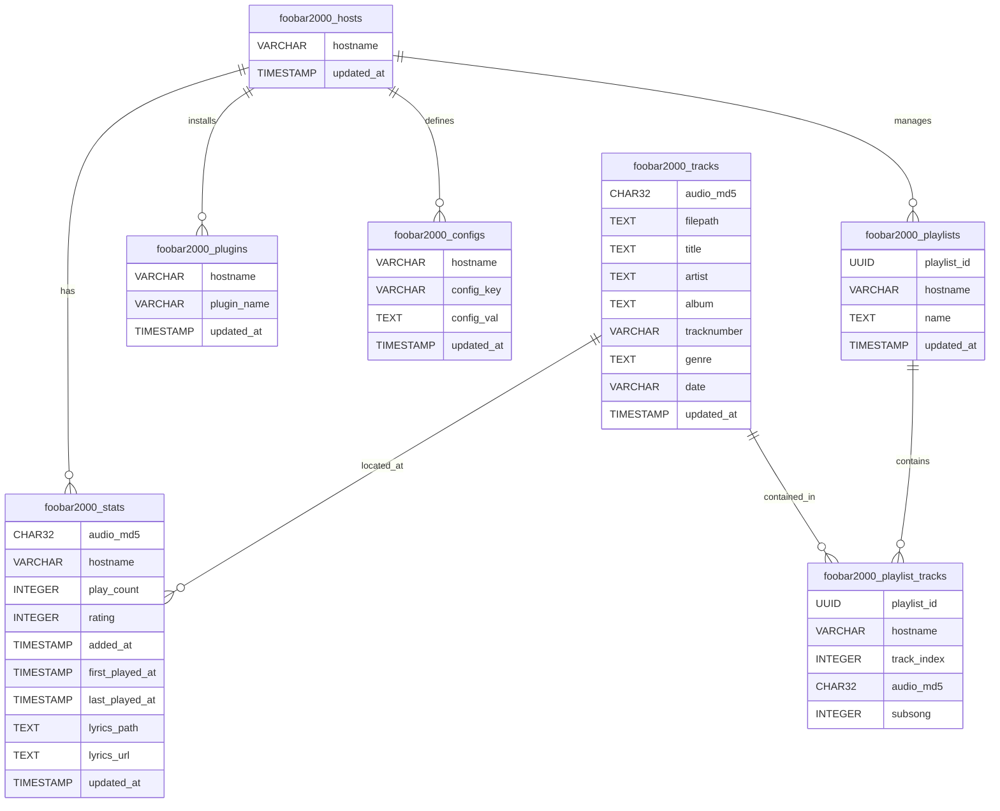

# foobar2000 PostgreSQL 同期ツール - foobar2000 PostgreSQL Synchronization Tool

## 0. なにこれ？ - What is this?
このプロジェクトは、ローカル環境の foobar2000 v2.0 から楽曲ライブラリ情報、プレイリスト、再生統計、インストール済みプラグイン、および設定値を自動抽出し、PostgreSQL データベースへ一括インポート（UPSERT）して一元管理するための ETL ツールですわ。 - This project is an ETL tool designed to automatically extract music library information, playlists, playback statistics, installed plugins, and configuration settings from a local foobar2000 v2.0 environment, and bulk-import (UPSERT) them into a PostgreSQL database for centralized management.

NAS などの共有ライブラリ環境を前提とし、複数の PC（ホスト）から同一のデータベースへデータを集約して同期・管理できます。 - Designed with shared NAS libraries in mind, it allows aggregating, synchronizing, and managing data from multiple PCs (hosts) into a single database.

---

## 1. 使い方 - How to use

### A) データベーステーブルの初期化 - Initializing Database Tables
インジェストを実行する前に、PostgreSQL 管理者（admin）として `setup/init.sql` を実行し、必要なテーブルをあらかじめ作成しておきます。 - Before running the ingestion script, execute `setup/init.sql` as a PostgreSQL administrator (admin) to pre-create the necessary schemas and tables.
```bash
# PostgreSQLサーバー上で実行 - Execute on the PostgreSQL server
psql -h <host> -U <user> -d <dbname> -f setup/init.sql
```

### B) 設定ファイルの編集 - Editing the Configuration File
`config.toml` を作成し、接続先 PostgreSQL URL と AppData 配下の SQLite データベースへのパスを指定します。 - Create `config.toml` and specify the destination PostgreSQL URL and paths to the SQLite databases under AppData.
```toml
[database]
url = "postgres://<user>:<password>@<hostname>:5432/<DBname>"

[source]
metadb_path = "C:\\Users\\<username>\\AppData\\Roaming\\foobar2000-v2\\metadb.sqlite"
customdb_path = "C:\\Users\\<username>\\AppData\\Roaming\\foobar2000-v2\\customdb_sqlite.db"

[target]
db_dir = "your\\path\\to\\repo\\foobar2000_db\\db"
```

### C) スクリプトの実行 - Running the Script
Python を用いて ETL インジェスト処理を実行します。不定期で何度実行しても、最新状態に安全に同期される冪等性が保証されています。 - Run the ETL ingestion process using Python. It is guaranteed to be idempotent, meaning you can run it repeatedly to safely synchronize the database with the latest state.
```bash
python.exe ingest.py
```

### D) データの初期化（やり直し） - Clearing Data (Resetting)
もしデータや統計情報を一度リセットし、最初からやり直したい場合は `setup/delete.sql` を Postgres 上で実行します。 - If you want to reset all data and statistics to start fresh, execute `setup/delete.sql` on the PostgreSQL server.
```bash
psql -h <host> -U <user> -d <dbname> -f setup/delete.sql
```

---

## 2. ステートマシン図、状態遷移図 - State Machine Diagram / State Transition Diagram

スクリプト実行時におけるデータ抽出、マージ、および PostgreSQL へのアップロード処理の状態遷移図ですわ。 - Below is the state transition diagram of data extraction, merging, and uploading to PostgreSQL during script execution.



---

## 3. ER図 - ER Diagram

複数ホストからのデータ統合と NAS 共有パスの重複排除を考慮した挿入 - database schema design diagram considering multi-host integration and deduplication of shared NAS pathing.


